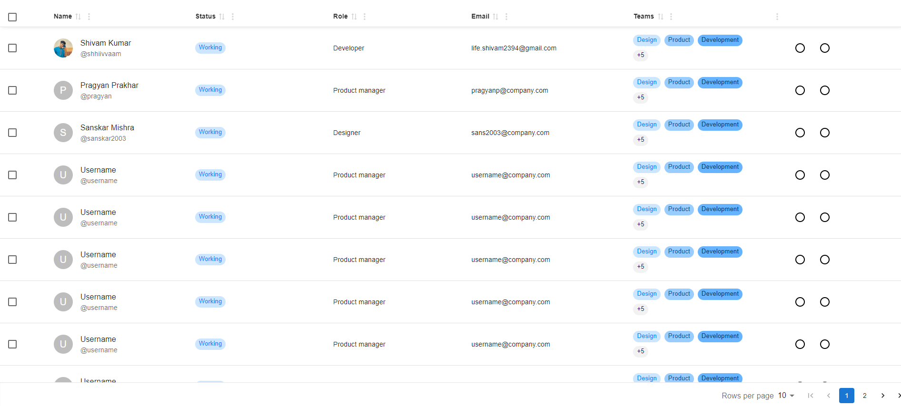

## JSON Driven Table UI with React and Material React Table v2

This project showcases a configurable, JSON-driven table UI built with React and Material React Table v2. The table supports features such as debounced name filtering, multi-select role filtering, age-based sorting, pagination, row selection, and displays user images.



---

## Features

1. Debounced Name Filtering: Allows users to filter table entries by name with a debounce to optimize performance.
2. Multi-Select Role Filtering: Enables filtering of table entries based on multiple selected roles.
3. Age-Based Sorting: Provides sorting functionality for the age column.
4. Pagination: Manages large datasets by displaying data across multiple pages.
5. Row Selection: Allows users to select individual rows for further actions.
6. User Images: Displays a profile image for each person in the table.

## Run the Project

```bash
git clone https://github.com/shhiivvaam/frontend_assign.git
cd frontend_assign
npm install
npm run dev
```

## Usage

1. Use the Search Name input to filter entries by name. Search is debounced to improve performance.
2. Use the Role multi-select dropdown to filter entries based on selected roles.
3. Click on the Age column header to sort entries by age.
4. Navigate through pages using the pagination controls at the bottom of the table.
5. Select rows by clicking on them; selected rows can be used for further actions as needed.

## Configuration

The table's schema and data are driven by JSON configurations:

`User Schems Configuration`

```json
User = {   
	id: string   
	name: string   
	username: string   
	status: string   
	role: string   
	email: string   
	teams: string[]   
	age: number   
	avatar: string 
}
```

`Table Schema: Defines the structure and behavior of the table columns`

```json
[   
	{
 		accessorKey: "status",
                header: "Status",filterVariant: "select",
                filterSelectOptions: ["Working", "On Leave", "Offline"],
	} 
	{ 
		accessorKey: "role",
                header: "Role", filterVariant: "multi-select",
                filterSelectOptions: ["Product manager", "Designer", "Developer", "QA Engineer"],
	},   
	{ 
		accessorKey: "email",
                header: "Email", 
	},   
	{ 
		accessorKey: "teams",
                header: "Teams", 
	},   
	{ 
		accessorKey: "age",
                header: "Age",
                enableColumnFilter: false, 
	},   
	{ 
		id: "actions",
                header: "",
		enableColumnFilter: false,
                enableSorting: false, 
	},
]
```

`Table Data: Provides the content to be displayed in the table`

```json
[   
	{   
		id: "1",   
		name: "Shivam Kumar",   
		username: "shhiivvaam",   
		status: "Working",   
		role: "Developer",   
		email: "life.shivam2394@gmail.com",   
		teams: ["Design", "Product", "Development", "Marketing", "Sales", "Support", "QA", "DevOps"],
       		age: 21,   
		avatar: "https://avatars.githubusercontent.com/u/96204332?s=400&u=154b02f4360fdbda52352f068986f73984d9f9e2&v=4?height=40&width=40"   
	} 
]
```

#### `These configurations can be modified to customize the table's appearance and functionality.`
